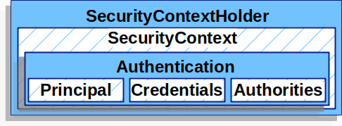
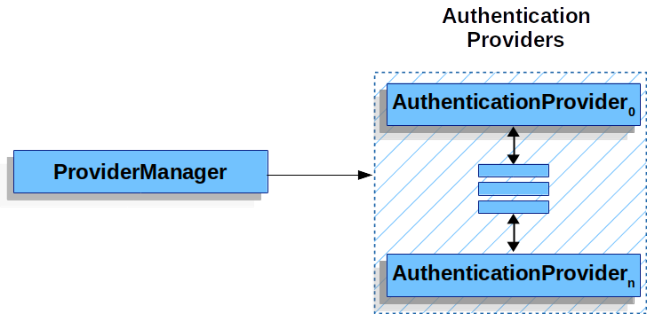

# Authentication Architecture

기존의 시큐리티 필터에서 확장되어 Servlet 인증에서 사용되는

아키텍쳐의 구성요소에 대해서 알아보고자 한다.

# SecurityContextHolder에 대해서

크게 다음과 같이 구성되어있으며 이는 Spring Security 의 인증 모델에서
핵심적인 역할을 하고 있다.

- SecurityContextHolder

SecurityContext 들을 보관하는 장소이다.

- SecurityContext

현재 인증된 사용자에 대한 정보를 보관하고 있다. - Holder에 포함되어있음.

- Authentication

AuthenticationManager에 의해서 인증에 성공할 경우 만들어져서 주입된다.

Spring Security는 해당 ContextHolder 내부에 SecurityContext가 존재한다면 인증된 사용자로 취급한다.

## SecurityContext

SecurityContextHolder 내부에 포함되어있고 Authentication을 가지고 있다.

## Authentication

SecurityContext 내부에 있는 Authentication은 두가지 용도로 사용되어진다.

1. AuthenticationManager에 의해 입력되기 위하여

사용자가 로그인을 시도할 때 포함된 정보(이메일이랑 비밀번호 등등) 는

Authentication 객체에 저장되어서 AuthenticationManager에 전달되어진다.

이때는 isAuthenticated() 가 false로 반환되어진다. (Manager에서 인증 전)

2. 인증된 사용자 정보 저장

사용자가 성공적으로 인증되면, 이것도 Authentication 객체에 저장된다.

이 정보는 SecurityContext를 통해서 접근할 수 있고, 애플리케이션 전체에서

로그인된 사용자의 정보를 참조할 수 있게 된다.

## Authentication 내부에는 무엇이 있는가?

### principal

인증된 사용자의 주요 식별정보이다. 보통은 UserDetails 객체

ex) 계정 정보(이메일 등)

### credentials

사용자의 비밀번호, API 키 같은 인증수단이다. 보안을 위해서 사용자의 인증이 완료되면

isAuthenticated() = true

해당 정보는 제거된 상태로 있을 수 있다.

### authorities

사용자에게 특정 권한이나 역할 부여를 위한 정보가 위치해있다.

관리자 권한이라던지, 일반 사용자, 결제된 사용자 등등...

# GrantedAuthority

Autentication 내부에 있는 authority과 연관되어있다.

Autentication.getAuthorities() 메소드를 통해서 GrantedAuthority 컬랙션을 얻을 수 있으며

애플리케이션 전반적인 영역에서 접근 권한에 대해서 제어가능하다.

즉, principal(해당 사용자에 대한 식별정보 == 해당 사용자)에 대해서 부여된 권한 인 것이며

UserDetailsService에 의해서 로드되어진다.

다만, 세부적인 특정 도메인에 대해서 권한으로는 표현되기 힘들다

ex) 내생각으로는, 게시글의 주인만 삭제 가능한 기능 등에 대해서 권한으로 설정 이런 것이 안된다는 뜻?

# AuthenticationManager

SpringSecurity 의 필터들이 어떻게 인증을 수행하는 지에 대해 정의된 인터페이스이다.

주로 ProviderManager로 구현되어진다.

사용자가 자신의 자격 증명(Authentication)을 제공(비밀번호 등...) 하면 - 검증을 진행하는 필터에서 객체가 생성

매니저가 이것을 받아서 검증하고 통과하면 SecurityContextHolder로 들어가게 되는 것이다.

# 지금까지의 흐름 정리

1. 사용자가 로그인을 요청한다. (사용자 이메일 + 비밀번호 등등 자격증명 포함)

2. 서블릿 컨테이너의 스프링 시큐리티에서 인증필터를 거침 (예를 들어 UsernamePasswordAuthenticationFilter 등)

3. 해당 인증 필터에서 사용자의 자격증명을 이용해서 Authentication 객체를 생성함. (isAuthenticated() = false 상태)
    이 때는 principal과 credentials 정도만 가지고 있을듯?

4. AuthenticationManager 호출 - 인증에 대한 검증을 진행한다.

5. AuthenticationManager 인터페이스에 알맞은 구현체 빈을 찾는 과정

6. 주로 ProviderManager 형태로 구현하고, 이는 여러개의 AuthenticationProvider르 가지고 있음

7. 해당 목록을 순환하면서 각각 인증을 진행

8. 인증이 성공되면, SecurityContextHolder 에 저장되어진다.

# ProviderManager

AuthenticationManager의 가장 일반적인 구현으로 사용되는 것이다.

AuthenticationProvider 인스턴스 리스트에게 위임함으로, 각각의 

AuthenticationProvider 들은 인증을 성공하거나 실패함으로 다음 AuthenticationProvider로

가는 것을 결정할 수 있게 된다.

