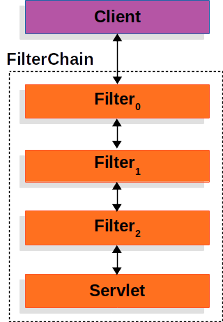
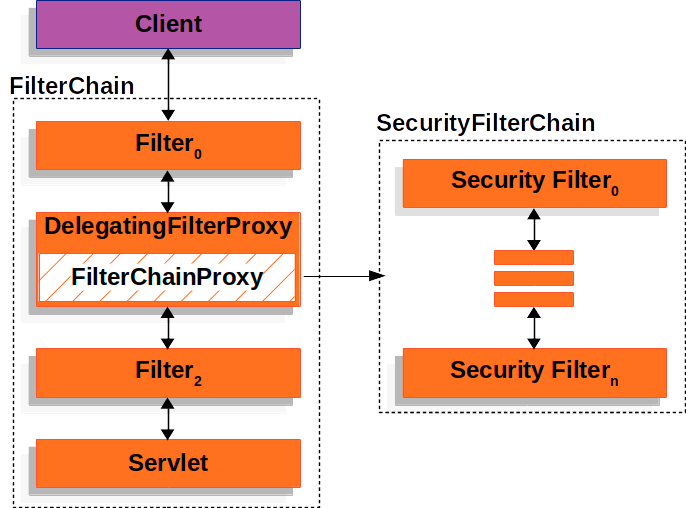
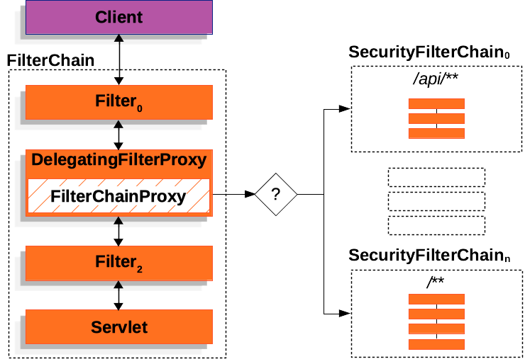

# 스프링 시큐리티 작동 원리

https://docs.spring.io/spring-security/reference/servlet/architecture.html#servlet-architecture



가볍게 내가 이해하는 수준에서 정리해보겠다.

## Request가 올 때

클라이언트(외부)에서 서버로 http request가 날라오는 경우를 생각해보자.

스프링을 이용하면 이 부분은 자동으로 처리를 해줘서 생각할 필요가 없지만,

외부의 http 요청은 서블릿 컨테이너 (스프링에서는 보통 Tomcat)로 모이게 된다.

서블릿 컨테이너는 해당 http요청을 컨테이너 내의 알맞은 서블릿에게 보내준다.

ex) 이 요청은 스프링 컨테이너(서블릿 객체)로 가야겟구나... 같이

스프링 시큐리티는 이 과정에서 스프링 컨테이너로 가기 전에 서블릿 필터로써 요청을 가로챈다.

(스프링컨테이너는 서블릿 컨테이너에서 서블릿으로 동작한다.)

### 서블릿 필터는 무엇인가?

서블릿 필터는 HTTP 요청과 음답을 변환시키는 역할을 하는 것이다.

게임에서 욕설 필터링이라고 생각해보자.

내가 '이 참치놈아' 라고 월드채팅을 치면, '이 ***아'라고 변경되서 나오는데,

내가 한 요청 ('이 참치놈아'라고 채팅을 월드채팅창에 입력해줘)을 변환한 것이다.

즉, 서블릿 필터는 서블릿 객체로 가는 http에 대한 변형을 할 수 있는 것이라고

생각할 수 있다.

## 서블릿 필터로써의 스프링 시큐리티

특정 요청을 특정 서블릿으로 가는 것을 막거나 수정한다.

이 때 필터의 순서도 중요함!! 필터는 하위의 필터 혹은 서블릿에만 영향을 미칠 수 있기 때문

### 서블릿 컨테이너는 스프링 빈을 몰라

스프링 시큐리티에서 관련된 필터를 작성할 때는 우리는 스프링 빈 내부에서 작성하게 된다.

하지만 서블릿 컨테이너는 스프링 빈을 모른다.

따라서 필터는 프록시를 통해서 스프링 빈에게 그 역할을 위임하는 방식으로 동작된다.

ex)

스프링 시큐리티가 서블릿 컨테이너에 서블릿 필터를 등록시켜둠

요청이 들어옴 -> 서블릿 필터(스프링 시큐리티)가 요청을 먼저 받음 -> 프록시로 받고 스프링 컨테이너에서

위임된 빈을 찾아서 그쪽으로 처리를 넘김

## 지금까지 정리

1. 요청이 온다 -> 서블릿 컨테이너에서 필터들을 통해서 서블릿으로 넘어감
2. 이 '필터들' 중에 스프링 시큐리티의 필터가 있음
3. 서블릿 컨테이너는 스프링 빈을 모름. 따라서, DelegatingFilterProxy라는 필터가 있다.
4. DelegationFilterProxy는 실제 처리될 빈을 알고 있다.
5. ApplicationContext에서 getBean을 통해서(빈을 얻어서) 해당 빈에게 처리를 위임한다.

## 저는 필터 체인으로 할건데요?

필터 하나가 아닌 여러개의 필터를 거치고 싶다면?

스프링 시큐리티에서는 FilterChainProxy 빈을 통해서 SecurityFilterchain을 호출하는 방식으로 한다.

SecurityFilterChain도 빈이고 내부에는 여러개의 SecurityFilter 빈을 가지고 있다.



따라서, 요청이 DelegatingFilterProxy 필터를 지날 때, 해당 필터는 FilterChainProxy를 통해서

SecurityFilterChain을 호춣하게 된다.

### 그러면 그냥 DelegatingFilterProxy에 SecurityFilter 여러개 쓰면 안됨?

하지만, SecurityFilterChain 빈에서 등록해두는 것이 다음과 같은 이점을 준다.

1. 필터체인에 대한 다양한 구성의 용이성
    특정 요청에 대해서는 필터 몇개가 더 추가될 수도 있고 등등에서 SecurityFilter에 대한 재사용 등.?
2. 디버깅의 이점
   디버깅 시에서 FilterChainProxy를 통해서 잡아서 쓸 수 있음.
3. 스프링 컨테이너 내부에서 돌아가게됨.
   DelegatingFilterProxy에 여러개의 빈을 등록해서 사용하면 스프링 컨테이너 -> 서블릿 컨테이너 -> 스프링 컨테이너
   이런 방식으로 flow가 컨테이너 사이들을 넘나들게 되고, 여기서 문제가 생길 수 있다...?

메모리 관리에도 용이함을 제공하고... 기타 공격등에서도 안전하게 지켜줄 수 있다고 한다...

(보기만 해서는 잘 모르겠음)



위 그림은 필터체인에 대한 다양한 구성의 선택가능 을 보여줌

## SecurityFilterChain은 어떻게 되어있는가?

이제 그럼 서블릿 필터에서 DelegatingFilterProxy가 FilterChainProxy 빈를 가지고 있고

FIlterChainProxy 빈이 알맞은 SecurityFilterChain 빈을 호출함을 알 수 있다.

SecurityFilterChain은 여러개의 SecurityFilter빈을 가지고 있다.

다음의 SecurityConfig 클래스를 보자.

```java
@Configuration
@EnableWebSecurity
public class SecurityConfig {

    @Bean
    public SecurityFilterChain filterChain(HttpSecurity http) throws Exception {
        http
            .csrf(Customizer.withDefaults())
            .authorizeHttpRequests(authorize -> authorize
                .anyRequest().authenticated()
            )
            .httpBasic(Customizer.withDefaults())
            .formLogin(Customizer.withDefaults());
        return http.build();
    }

}
```

SecurityFilter 는 SecurityFilterChain API를 통해서 삽입되어진다.

위의 코드에서는 CSRF 공격으로 부터의 필터가 호출되어지고,
사용자 인증 필터가 호출되어진다. (너는 너가 맞아?)
그 다음 권한 부여 필터가 호출되며 사용자의 작업에 대해 권한이 있는 지 확인한다.


